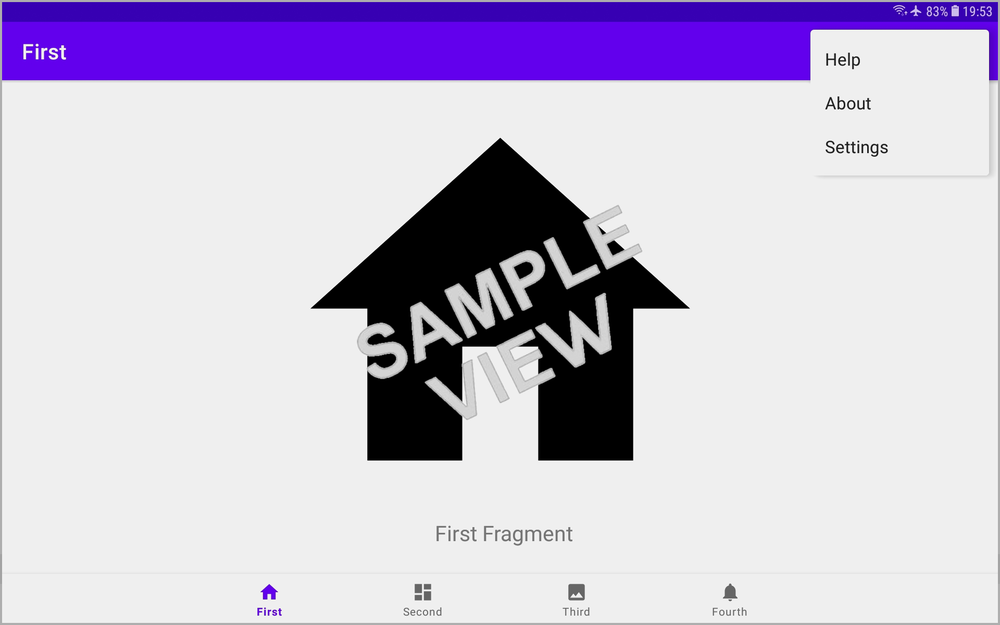
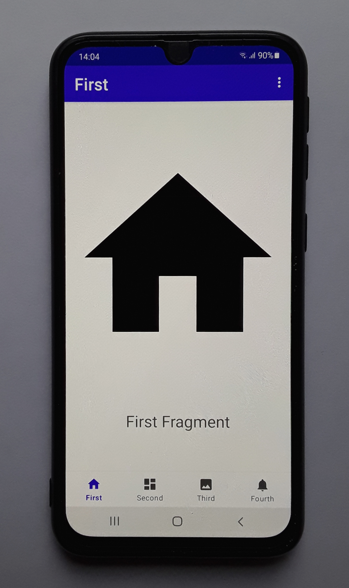
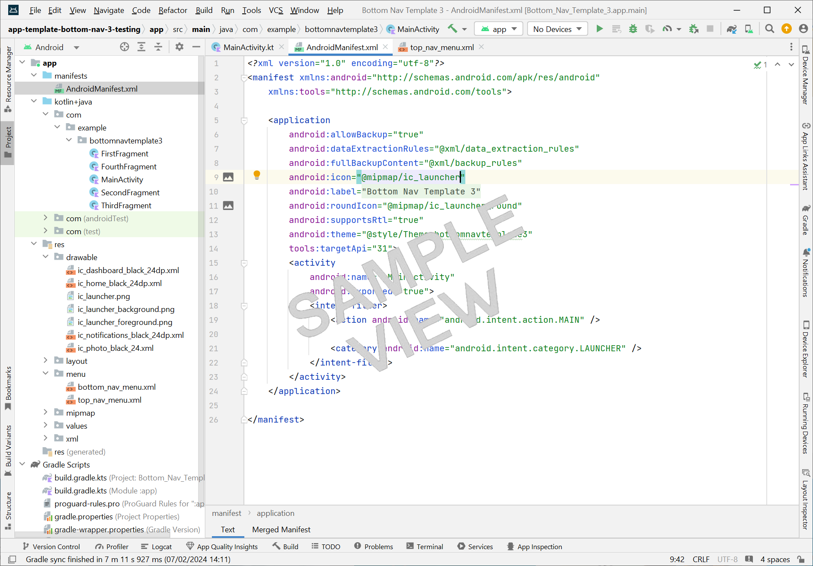

# A free template for an android app with a bottom navigation bar that has swipeable views and a top options menu:

## Files available to download:
* Here's the .apk if you just want to try it out (app-template-bottom-nav-3.apk):

[Download the .apk (.zip)](https://github.com/boxbot6/app-template-bottom-nav-with-swipe-and-top-options-menu/raw/main/downloads/app-template-bottom-nav-3-demo.zip)

 

* Here are all the Android Studio files inside a project folder (AppTemplateBottomNav3Project) - unzip the download and then drag the whole folder onto your Android Studio desktop icon to open it (or select the folder from 'File > Open' menu within an open instance of Android Studio): 

[Download the project files (.zip)](https://github.com/boxbot6/app-template-bottom-nav-with-swipe-and-top-options-menu/raw/main/downloads/app-template-bottom-nav-3-project.zip)

 

## To copy and use the template:
* If you haven't already got Android Studio, install it on your computer - Link here: [developer.android.com](https://developer.android.com/studio?gclid=EAIaIQobChMIh6-kh9rsgwMVjZNQBh3tCQlSEAAYASAAEgJ0AfD_BwE&gclsrc=aw.ds)  (I used the Hedgehog version 2023.1.1 to create the template).
* Download the project files 'app-template-bottom-nav-3.zip' to your computer, unzip it and then drag the whole folder onto your Android Studio desktop icon to open it (or select the folder from 'File > Open' menu within an open instance of Android Studio).
* For first-timers probably stick to the project name as it is because changing the name is a bit convoluted.
* After everything synchronises, imports and opens (this may take quite a few minutes) try Build > BuildBundle(s)/APK(s) > Build APK(s) from the top menu to build the app.
* If the template builds OK without any problems move on to personalising your new app in next section.
* Just a note about Android Studio - please be aware that it is very large and very slow and is hardly ever compatable with any older projects or examples that you are likely to download and try to use so you may have to persevere to get anything to work - usually by repeatedly attempting to build the apk and then having to correct any errors listed in the build log (fix these errors by searching for answers on 'stack overflow' etc. or by updating the various Android Studio program elements and trying again).
* If you feel confident you can either rename the project (look for online tutorial if you are not sure how to do this) or start a new project using the built-in template 'Empty Views Activity' or 'Bottom Navigation Views Activity' with the new name that you want and then copy all the files across from the downloaded template to the new project (this is not straightforward and takes a bit of time but it is a good place to learn the layout of the different types of files and where they are located - in general systematically copy one file at a time, moving the body of the code for each file from the downloaded template to the new project (keep the new projects package id's) and then copy across and update all the other associated references such as strings, values, drawables, menus, themes, gradle files etc.

  
* Check the list of imports at the top of the Kotlin/java files (you can delete any greyed-out unused ones and add any missing imports to this list by right-clicking any red highlighted items in the body of the code and select add import (and then generally choose the top one from list of imports that appears).
* Please also remember to include the dependency for ViewPager2 that should be placed in the gradle file 'build.gradle.kts(module:app)' it looks like this: dependencies { implementation("androidx.viewpager2:viewpager2:1.0.0")
* Correct any other code that becomes highlighted in red - please be aware that you may have to build, sync or even save and restart your session Android Studio to clear some of these errors if they persist.
* When you eventually have a project that Android Studio builds without any errors you can use the emulator to test it or you can build the actual app to test on your device by selecting: Build > BuildBundle(s)/APK(s) > Build APK(s), and wait for it to build the .apk (this may take a long time - please wait for the progress bar to complete).
* After building the apk a dialog box 'Build APK(s)' appears in the bottom right of Android Studio - click on 'locate', then 'debug', then rename the 'app-debug.apk' file to 'test' or whatever other name you want for the apk, then copy the apk to your device to test it there. (don't forget to allow apps from unknown sources)
* Also bear in mind what version of Android you are using and is it compatible?
* It may look or work differently on your device than it did in the emulator so you may have to adjust the code for any inconsistencies that become obvious when you test it. 
* You can now move on to personalising your app.

 

## Some notes on personalising your new app:
* You can now personalise the template by directly adding to and editing the contents of each page/fragment and also by editing MainActivity.kt (the main activity that holds the fragments) until you are satisfied with the results and then you can build your .apk again.
* A good place to start is to try editing the top options menus - look in menu > top_nav_menu.xml to change the names of the items that show up in the top menu list and then look in MainActivity.kt to edit the content of the dialogs - eg: edit the text shown in a dialog by changing the .setMessage("Your Text Here") field or the title of the dialog by changing .setTitle("Title"). You can also add buttons, icons, images, links and many other functions to the dialog boxes here.
* If you are renaming anything in Android Studio right-click it and select Refactor > Rename to collectively change all instances of it and everything linked to it throughout the whole project.
* Each page/fragment consists of a Kotlin or Java file which codes it and an associated .xml layout file which displays it. Navigation between the fragments is referenced in menu > bottom_nav_menu.xml. 
* The best way to start modifying the code in a fragment and its associated layout is to add code that you have already tested in other projects and you know already works with your version of Android studio (although the code may possibly need changing a little bit to work in a fragment rather than an activity).
* In the AndroidManifest.xml update the icon that your android app shows by adding a 512x512 pixel icon in .png format to the drawable folder and updating android:icon="@drawable/name_of_the_icon_you_added_to_drawable_folder_here" and the name that shows for the app by changing android:label="app_name_you_want_to_show_here".
* Put any images you want to use in the project into the drawable folder and link to them by using "@drawable/name_of_the_image_you_added_to_drawable_folder_here".
* As a general rule in Android Studio try to use reference strings like "@string/text_reference_here" to add text to layouts rather than putting the text directly in the layout code (so put the actual text you want to use in values > strings.xml and reference it).
* Add new fragments by right-clicking on the folder that contains your MainActivity and Fragments and select New > Fragment > Fragment (Blank), or just rename the existing fragments/pages to whatever you like (make sure you use right-click Refactor > Rename to properly change all the references to it everywhere).
* Tidy up and complete any fragment or menu code additions by studying and duplicating the way the code is used for the existing fragments/pages - don't forget the navigation references. 
* Use right-click 'Find Usages' to check what things are connected to and 'Delete > Safe Delete' before removing things to make sure it is ok to get rid them.
* Delete any instances of 'import android.R.id.content' which sometimes shows up in the list of imports after editing and messes up the apps ability to find the correct location of things. 

 

## A few things to note about the code:

* I have converted the code to Kotlin for this project as it seems to be the standard now, I also used ViewPager2 which changed the code in places from my original version. 
* In the third page/fragment I added a scrollview and some buttons as an example to show how to do this in a fragment (this needed a bit of modifying to keep the layout looking like the other fragments because it is inside a scrollview and so I needed to use 'viewTreeObserver' to measure the height of the original parent view and then use it in the scrollview 'layout3' to match the initial height of what is shown to all the other fragments.
* For help on most things regarding Android Studio go to [stackoverflow.com](https://stackoverflow.com/) and dig through the answers and examples there.

 

---

# github-pages-site:

### app-template-bottom-nav-with-swipe-and-top-options-menu

 

* [Click this link to view the website being created from this repository and hosted on github-pages (https://boxbot6.github.io/app-template-bottom-nav-with-swipe-and-top-options-menu/).](https://boxbot6.github.io/app-template-bottom-nav-with-swipe-and-top-options-menu/)

 

---
